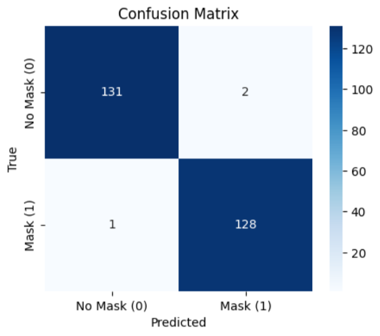
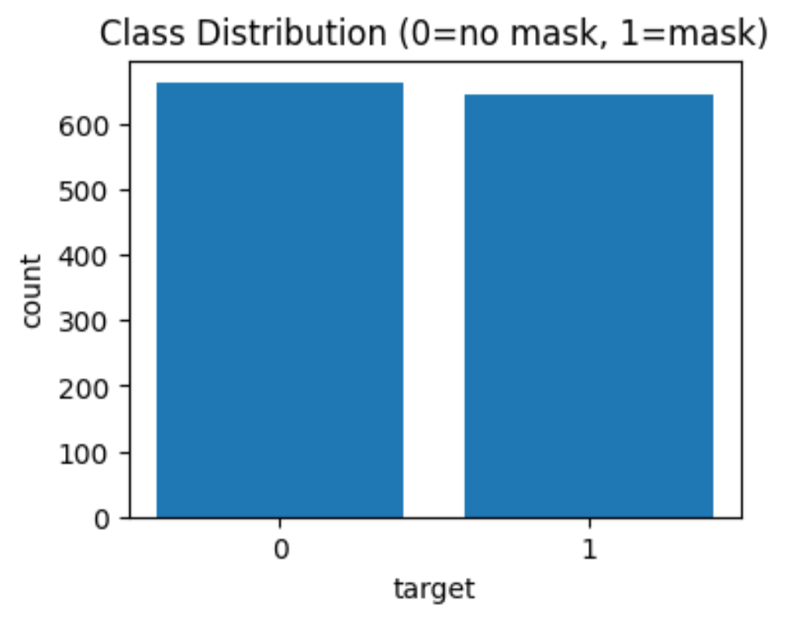
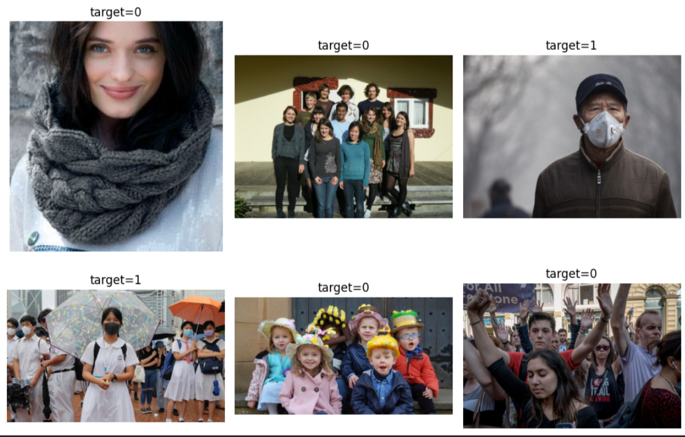

# Spot the Mask Challenge 🩺😷  

This repository contains my solution for the **[Zindi Spot the Mask Challenge](https://zindi.africa/competitions/spot-the-mask-challenge)**.  
The goal of the challenge is to build a computer vision model that can detect whether a person is wearing a mask or not from an image.  

---

## 📊 Challenge Summary
- **Type**: Image Classification (Binary: Mask / No Mask)  
- **Frameworks**: PyTorch, torchvision, numpy, pandas  
- **Approach**: Transfer Learning with MobileNetV2 (pretrained on ImageNet)  
- **Result**: Ranked **73rd out of 212 participants** on the Zindi Leaderboard 🎉  

---


---

## 🚀 Approach
1. **Data Exploration**
   - Visualized class distribution and dataset samples.
   - Confirmed balance/imbalance of mask vs no-mask classes.

2. **Model Training**
   - Used **MobileNetV2** for transfer learning.
   - Applied image augmentations (resize, normalization, flips).
   - Optimizer: Adam | Loss: BCEWithLogitsLoss | Scheduler: StepLR  
   - Saved the best performing checkpoint.

3. **Evaluation**
   - Confusion matrix and class distribution plotted.
   - Achieved stable validation accuracy.
   - Generated submission CSV with predicted probabilities.

4. **Leaderboard Submission**
   - Submitted predictions on the hidden test set.
   - **Final Rank: 73rd / 212 participants**.

---

## 📈 Results
- **Confusion Matrix:**  
  

- **Class Distribution:**  
  

- **Sample Data:**  
  

---

## ⚙️ How to Run
```bash
# Clone repo
git clone https://github.com/your-username/spot-the-mask-challenge.git
cd spot-the-mask-challenge

# Install dependencies
pip install -r requirements.txt

# Open the notebook
jupyter notebook spot-the-mask-challenge.ipynb

